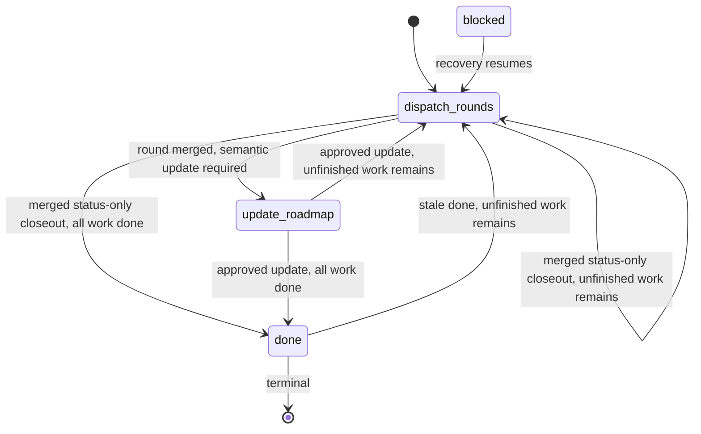
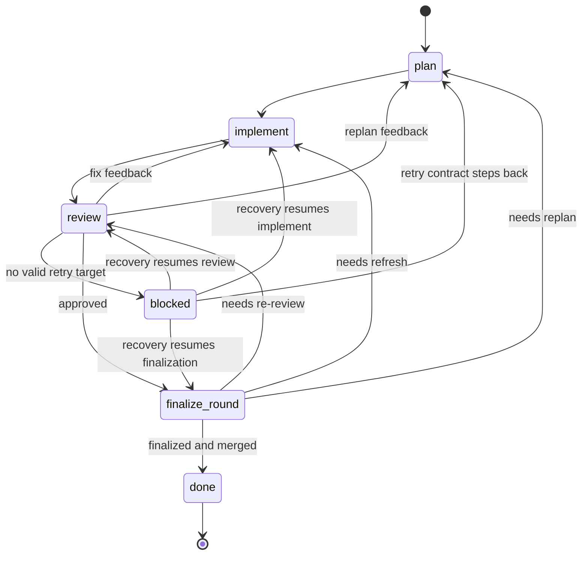

# State Machine

The controller may manage multiple live rounds at once, but each round follows
one strict legal stage order.

This file is the authoritative lifecycle Interface. Resume, worktree,
finalization, and role docs may define predicates and observations, but legal
stage transitions live here.

## Controller Stages

1. `dispatch-rounds`
2. `update-roadmap`
3. `done`
4. `blocked`

## Round Stages

1. `plan`
2. `implement`
3. `review`
4. `finalize-round`
5. `done`
6. `blocked`

`blocked` is a persisted recovery-needed snapshot, not a terminal success or
failure state. On the same controller pass or the next resume, the controller
must attempt to leave `blocked` through recovery work instead of stopping at
the recorded blockage note.

## Ownership

- `plan`: planner owns normal round selection and planning
- `implement`: implementer
- `review`: reviewer owns approval or rejection
- `finalize-round`: controller applies reviewer-approved status-only roadmap
  bookkeeping, derives merge admissibility, performs squash merge bookkeeping,
  and dispatches semantic roadmap updates when required
- semantic `update-roadmap`: guider authors, reviewer approves

## Controller Legal Transitions

- `done` -> `dispatch-rounds` when unfinished milestones remain in the active
  roadmap bundle under `orchestrator/active-roadmap-bundle.md`
- `dispatch-rounds` -> `dispatch-rounds` after successful round merge with
  reviewer-approved status-only closeout already included in the squash commit
  when unfinished milestones remain
- `dispatch-rounds` -> `done` after successful round merge with
  reviewer-approved status-only closeout already included in the squash commit
  when no unfinished milestones remain
- `dispatch-rounds` -> `update-roadmap` after successful round merge when
  `review-record.json` requires a semantic roadmap update
- `update-roadmap` -> `dispatch-rounds` after approved roadmap update when
  unfinished milestones or live rounds remain
- `update-roadmap` -> `done` only when the active roadmap bundle has no
  unfinished milestones under `orchestrator/active-roadmap-bundle.md` and there
  are no live rounds
- `update-roadmap` -> `update-roadmap` after rejected roadmap-update review
  when the guider must revise the same roadmap-update branch/worktree
- `update-roadmap` -> `blocked` after 3 rejected roadmap-update attempts or a
  non-recoverable roadmap-update review rejection
- `blocked` -> `dispatch-rounds` when automatic recovery can resume from the
  same recorded round/stage or from stale blockage bookkeeping

## Round Legal Transitions

- `plan` -> `implement`
- `implement` -> `review`
- `review` -> `implement` when rejected review feedback can be addressed
  inside the existing plan and `review-record.json.retry_target` is
  `implement`
- `review` -> `plan` when rejected review feedback requires replanning and
  `review-record.json.retry_target` is `plan`
- `review` -> `blocked` when approval is attempted without a valid
  `review-record.json` closeout classification
- `review` -> `blocked` when a rejected `review-record.json` has
  `retry_target` set to `blocked` or lacks a valid retry target
- `review` -> `finalize-round` when approval is granted and
  `review-record.json` contains a valid `roadmap_closeout` classification
- `finalize-round` -> `implement` when base refresh or dependency drift requires
  substantive code refresh before merge
- `finalize-round` -> `review` when closeout revalidation shows the approved
  review record is no longer valid for the active roadmap bundle
- `finalize-round` -> `review` when re-review is required after refresh or drift
- `finalize-round` -> `plan` when the repo-local retry contract requires a new
  plan
- `finalize-round` -> `done` when closeout, merge admissibility, and squash
  merge all succeed
- `blocked` -> `plan`, `implement`, `review`, or `finalize-round` when
  recovery re-establishes controller-visible evidence for that same round/stage
  or the repo-local retry contract lawfully steps the round

If approved `update-roadmap` activates a new roadmap revision, the controller
must update `state.json` roadmap metadata before evaluating those transitions.
Status-only closeout, semantic roadmap update serialization, and merge
admissibility happen inside `finalize-round`; the exact predicates and records
live in [worktree-finalization-rules.md](worktree-finalization-rules.md),
`orchestrator/round-finalization-schema.md`, and
`orchestrator/roadmap-update-schema.md`. Merge admissibility is not a persisted
boolean in `state.json`.

Do not skip forward and do not invent parallelism that the roadmap or planner
artifacts do not authorize.

## Visual Overview

### Controller Flow

### Round Flow

