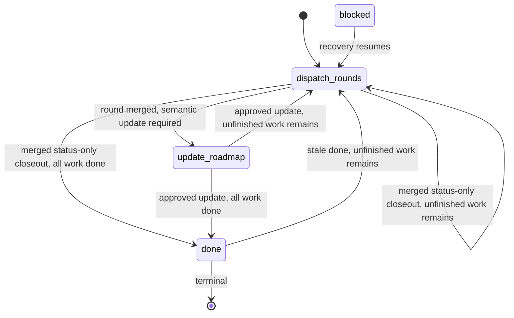
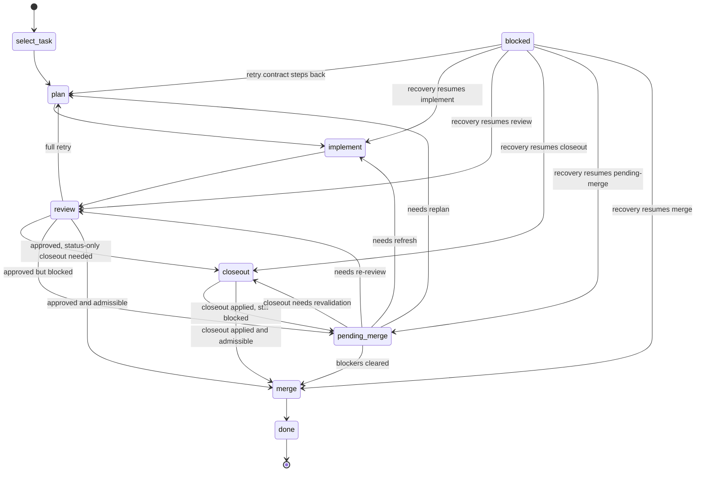

# State Machine

The controller may manage multiple live rounds at once, but each round follows
one strict legal stage order.

This file is the authoritative lifecycle Interface. Resume, worktree, merge,
and role docs may define predicates and observations, but legal stage
transitions live here.

## Controller Stages

1. `dispatch-rounds`
2. `update-roadmap`
3. `done`
4. `blocked`

## Round Stages

1. `select-task`
2. `plan`
3. `implement`
4. `review`
5. `closeout`
6. `pending-merge`
7. `merge`
8. `done`
9. `blocked`

`blocked` is a persisted recovery-needed snapshot, not a terminal success or
failure state. On the same controller pass or the next resume, the controller
must attempt to leave `blocked` through recovery work instead of stopping at
the recorded blockage note.

## Ownership

- `select-task`: guider
- `plan`: planner
- `implement`: implementer
- `review`: reviewer
- `closeout`: controller applies reviewer-approved status-only roadmap
  bookkeeping in the canonical round worktree
- `merge`: merger prepares notes, controller performs bookkeeping
- status-only round closeout: controller applies reviewer-approved status
  markers and compact completion pointers from `review-record.json`
- semantic `update-roadmap`: guider authors `roadmap-update.md`; reviewer
  approves `roadmap-update-review.md`

## Controller Legal Transitions

- `done` -> `dispatch-rounds` when unfinished milestones remain in the active
  roadmap bundle under `orchestrator/active-roadmap-bundle.md`
- `dispatch-rounds` -> `dispatch-rounds` after successful round merge with
  reviewer-approved status-only closeout already included in the squash commit
  when unfinished milestones remain
- `dispatch-rounds` -> `done` after successful round merge with
  reviewer-approved status-only closeout already included in the squash commit
  when no unfinished milestones remain
- `dispatch-rounds` -> `update-roadmap` after successful round merge when
  `review-record.json` requires a semantic roadmap update
- `update-roadmap` -> `dispatch-rounds` after approved roadmap update when
  unfinished milestones or live rounds remain
- `update-roadmap` -> `done` only when the active roadmap bundle has no
  unfinished milestones under `orchestrator/active-roadmap-bundle.md` and there
  are no live rounds
- `update-roadmap` -> `update-roadmap` after rejected roadmap-update review
  when the guider must revise the same roadmap-update branch/worktree
- `update-roadmap` -> `blocked` after 3 rejected roadmap-update attempts or a
  non-recoverable roadmap-update review rejection
- `blocked` -> `dispatch-rounds` when automatic recovery can resume from the
  same recorded round/stage or from stale blockage bookkeeping

## Round Legal Transitions

- `select-task` -> `plan`
- `plan` -> `implement`
- `implement` -> `review`
- `review` -> `plan` when the repo-local review contract requests full-round
  retry
- `review` -> `blocked` when approval is attempted without a valid
  `review-record.json` closeout classification
- `review` -> `closeout` when approval is granted, `roadmap_closeout.mode` is
  `status-only`, and the status-only edits have not yet been applied in the
  canonical round worktree
- `review` -> `pending-merge` when approval is granted, no status-only closeout
  remains to apply, and merge admissibility is blocked by base freshness,
  selection-record scheduler fields, or semantic roadmap-update serialization
- `review` -> `merge` when the repo-local review contract approves finalization
  and either `roadmap_closeout.mode` is `semantic-update-required` or
  status-only closeout is already applied in the canonical round worktree, and
  merge admissibility is derived as true
- `closeout` -> `pending-merge` when status-only closeout is applied but merge
  admissibility is blocked by base freshness, selection-record scheduler
  fields, or semantic roadmap-update serialization
- `closeout` -> `merge` when status-only closeout is applied and merge
  admissibility is derived as true
- `pending-merge` -> `implement` when base refresh or dependency drift requires
  substantive code refresh before merge
- `pending-merge` -> `closeout` when a status-only closeout must be
  revalidated or reapplied after base refresh
- `pending-merge` -> `review` when closeout revalidation shows the approved
  review record is no longer valid for the active roadmap bundle
- `pending-merge` -> `review` when re-review is required after refresh or drift
- `pending-merge` -> `plan` when the repo-local retry contract requires a new
  plan
- `pending-merge` -> `merge` when blockers clear and the round remains
  review-valid
- `merge` -> `done`
- `blocked` -> `select-task`, `plan`, `implement`, `review`, `closeout`,
  `pending-merge`, or `merge` when recovery re-establishes controller-visible
  evidence for that same round/stage or the repo-local retry contract lawfully
  steps the round

If approved `update-roadmap` activates a new roadmap revision, the controller
must update `state.json` roadmap metadata before evaluating those transitions.
Status-only round closeout must not change `roadmap_id`, `roadmap_revision`, or
`roadmap_dir`, and it must be applied and recorded in `closeout-record.json`
before the round squash merge so the closeout edits are included in the round
merge commit. Semantic roadmap updates are serialized through the single
`state.json.roadmap_update` slot.

Merge admissibility is derived from reviewer approval, valid round
finalization records, scheduler fields in `selection-record.json`, dependency
state, base freshness, and active semantic roadmap-update state. It is not a
persisted boolean in `state.json`.

Do not skip forward and do not invent parallelism that the roadmap or planner
artifacts do not authorize.

## Visual Overview

### Controller Flow

### Round Flow

