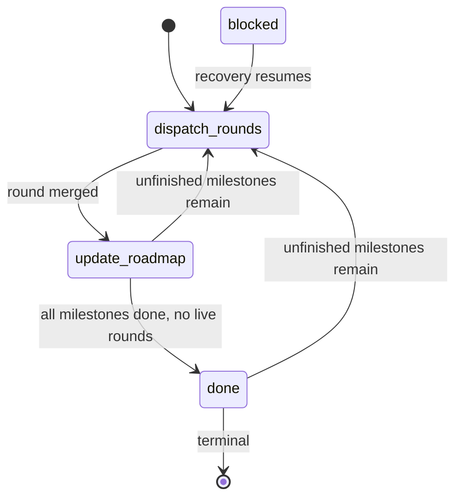
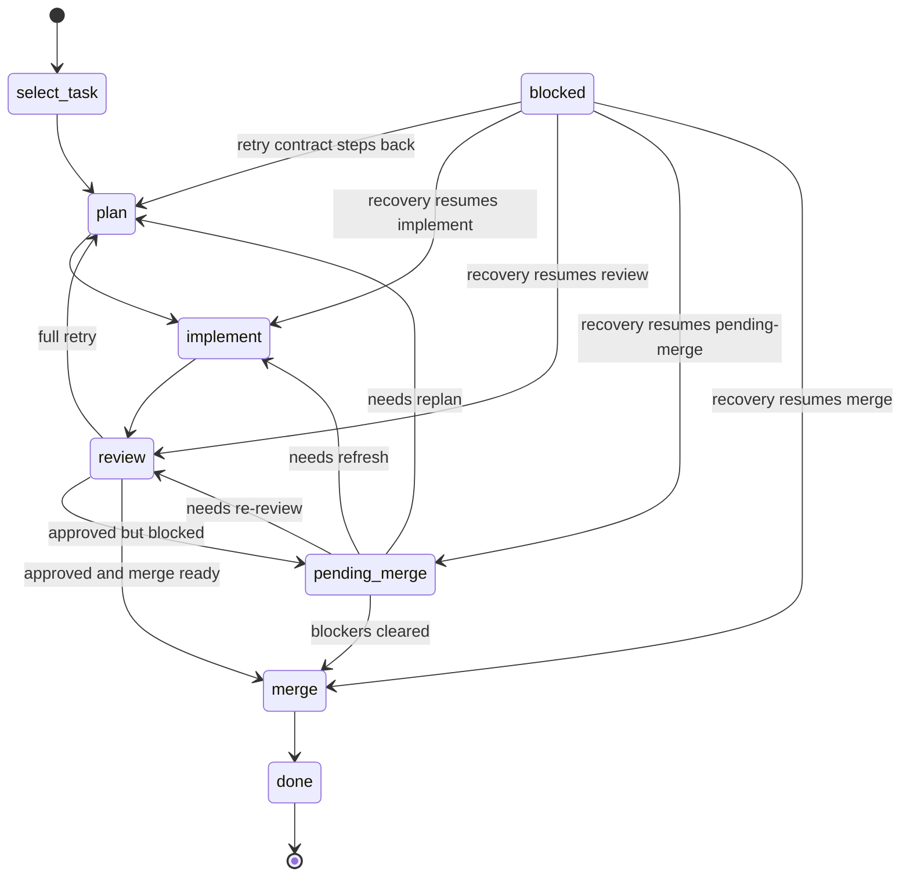

# State Machine

The controller may manage multiple live rounds at once, but each round follows
one strict legal stage order.

## Controller Stages

1. `dispatch-rounds`
2. `update-roadmap`
3. `done`
4. `blocked`

## Round Stages

1. `select-task`
2. `plan`
3. `implement`
4. `review`
5. `pending-merge`
6. `merge`
7. `done`
8. `blocked`

`blocked` is a persisted recovery-needed snapshot, not a terminal success or
failure state. On the same controller pass or the next resume, the controller
must attempt to leave `blocked` through recovery work instead of stopping at
the recorded blockage note.

## Ownership

- `select-task`: guider
- `plan`: planner
- `implement`: implementer
- `review`: reviewer
- `merge`: merger prepares notes, orchestrator performs bookkeeping
- `update-roadmap`: guider

## Controller Legal Transitions

- `done` -> `dispatch-rounds` when unfinished roadmap milestones remain
- `dispatch-rounds` -> `update-roadmap` after any successful round merge
- `update-roadmap` -> `dispatch-rounds` when unfinished roadmap milestones or
  live rounds remain
- `update-roadmap` -> `done` only when the active roadmap bundle has no
  unfinished milestones and there are no live rounds
- `blocked` -> `dispatch-rounds` when automatic recovery can resume from the
  same recorded round/stage or from stale blockage bookkeeping

## Round Legal Transitions

- `select-task` -> `plan`
- `plan` -> `implement`
- `implement` -> `review`
- `review` -> `plan` when the repo-local review contract requests full-round
  retry
- `review` -> `pending-merge` when approval is granted but merge readiness is
  blocked by base freshness or declared merge ordering
- `review` -> `merge` when the repo-local review contract approves finalization
  and `merge_ready` is true
- `pending-merge` -> `implement` when base refresh or dependency drift requires
  substantive code refresh before merge
- `pending-merge` -> `review` when re-review is required after refresh or drift
- `pending-merge` -> `plan` when the repo-local retry contract requires a new
  plan
- `pending-merge` -> `merge` when blockers clear and the round remains
  review-valid
- `merge` -> `done`
- `blocked` -> `select-task`, `plan`, `implement`, `review`, `pending-merge`,
  or `merge` when recovery re-establishes controller-visible evidence for that
  same round/stage or the repo-local retry contract lawfully steps the round

If `update-roadmap` activates a new roadmap revision, the controller must
update `state.json` roadmap metadata before evaluating those transitions.

Do not skip forward and do not invent parallelism that the roadmap or planner
artifacts do not authorize.

## Visual Overview

### Controller Flow

### Round Flow

